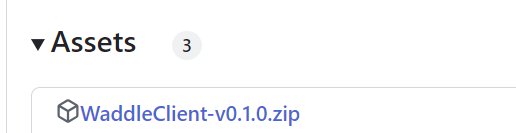

# How to play Waddle Forever

1. Download the latest version [here](https://github.com/nhaar/Waddle-Forever/releases/latest). In the "Assets" section, click the .zip to download it (Choose your version, windows or linux, only 64-bits supported):

2. Extract the folder

3. Open `WaddleForeverClient`. You will likely be warned by computer/antivirus, but you can accept everything as there is no risk in using this program.

4. Enjoy!

> [!WARNING]
> You can only have one client open at a time

# Logging In

You don't create accounts, all you need to do is to login with the name you want. You can use any password, it will always work.

# How to play in Browser or Flash Projector

Instead of using the built-in client, you can play in browser or flash projector if that is better for you.

1. In the Waddle Forever folder, there is a file called `WaddleForeverServer`. Open it and a command prompt will show up. This means the game is running.

2. For browser, go to `http://localhost/` to play. For Flash Projector, go to `http://localhost/boots.swf`.

# All Mission speedrun shortcuts

Two commands you should use for speedruns:

!epf - Teleports to the VR Room, where you can play the game (Currently, you can't become an EPF agent normally)

!awards - Gives you half the awards, so you can play it optimally

# Settings

Inside the client, you may edit the settings clicking Options -> Settings. Current settings:

* 30 FPS: If enabled, the game will be 30 FPS, need to reload and clear cache.

* Thin Ice IGT: Add speedrun timer to Thin Ice. Need to clear cache to enable.

> [!WARNING]
> Making changes in Flash Player requires you to clear cache. In the client you can do that easily in the menu, and it's usually easy for browsers too.
> Clearing cache for Flash Projector is harder as you need a special script for it.

# Data

You can change your database in the folder `data`.

> [!WARNING]
> Since we are still in Beta, the database of newer versions may NOT be consistent with older versions. If you really wish to port an older database, contact us!
