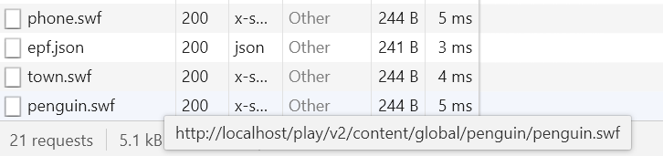
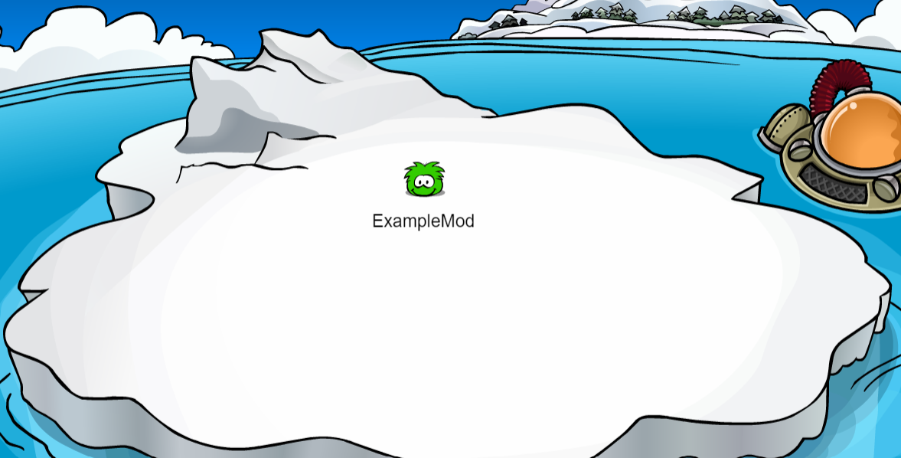

# Using mods in Waddle Forever

In this brief tutorial you will learn how to use mods in Waddle Forever

# How to add a mod

If you happen to already have a mod, then all you need to do is drop the mod inside the `mods` folder, in the directory you installed the game. Make sure to restart the game and then the mod will appear in the menu: Options > Open Mods.

# How to create a mod

To make a mod, first you will need to create a folder inside `mods` in the game directory and name it what you want the mod to be named.

Then, you will need your SWF files (or other non SWF files you want to modify). I assume you already have them with you, otherwise teaching how to get or make flash files is beyond the scope of this tutorial.

First, you will need to know the path of the file. To do this, you will have to go in the game and open the dev tools. Go on Options > Open Dev Tools, and a new section will open. In there, you should click in the "Network" tab.

With that open, go inside the game and search for which file you want to change.

For this example, let us make a mod which changes the penguin into a green puffle. Then, we go ahead and search for the penguin swf in the Dev Tools:

Hovering over the file displays the file path, which is everything after `http://localhost/`. Then, all you need to do is to go inside your mod's folder, and create a folder structure that follows that. In our case, `play/v2/content/global/penguin/penguin.swf`, so we create the folder `play`, inside it, the folder `v2`, and so forth until adding the file `penguin.swf`.

Then, our mod will be done! All you need to do is to restart the game, and enable it in the mods menu. Entering the game we can then see our mod in practice:

