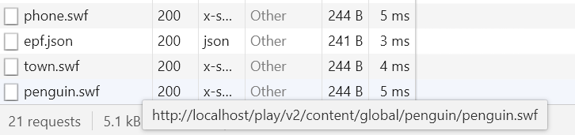
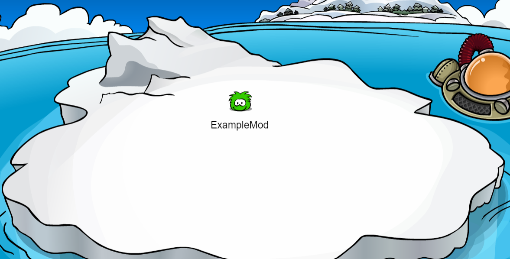
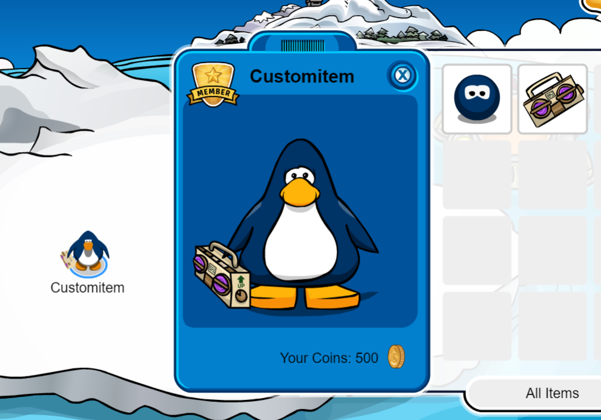

# Using mods in Waddle Forever

In this brief tutorial you will learn how to use mods in Waddle Forever

# How to add a mod

If you happen to already have a mod, then all you need to do is drop the mod inside the `mods` folder, in the directory you installed the game. Make sure to restart the game and then the mod will appear in the menu: Options > Open Mods.

# How to create a mod

To make a mod, first you will need to create a folder inside `mods` in the game directory and name it what you want the mod to be named.

Then, you will need your SWF files (or other non SWF files you want to modify). I assume you already have them with you, otherwise teaching how to get or make flash files is beyond the scope of this tutorial.

First, you will need to know the path of the file. To do this, you will have to go in the game and open the dev tools. Go on Options > Open Dev Tools, and a new section will open. In there, you should click in the "Network" tab.

With that open, go inside the game and search for which file you want to change.

For this example, let us make a mod which changes the penguin into a green puffle. Then, we go ahead and search for the penguin swf in the Dev Tools:



Hovering over the file displays the file path, which is everything after `http://localhost/`. Then, all you need to do is to go inside your mod's folder, and create a folder structure that follows that. In our case, `play/v2/content/global/penguin/penguin.swf`, so we create the folder `play`, inside it, the folder `v2`, and so forth until adding the file `penguin.swf`.

Then, our mod will be done! All you need to do is to restart the game, and enable it in the mods menu. Entering the game we can then see our mod in practice:



# How to add custom items

You can add custom items using the items file. In the folder of the mod, you must add a file named `items.json`. In the newest version of Waddle Forever, that file is created automatically if you use the `Create Mod` button. Here's an example of how you would add a single item:

```json
[
  {
    "id": 95000,
    "name": "Example Item",
    "type": 6,
    "layer": 7000,
    "cost": 0,
    "isMember": false,
    "isBack": false
  }
]
```

Keep in mind that:
- ID must be any number, but it shouldn't overlap with any vanilla item or with any other mod.
- Type must be a number, with these values:
```
Color: 1
Head: 2
Face: 3
Neck: 4
Body: 5
Hand: 6
Feet: 7
Pin: 8
Background: 9
Award: 10
```
- Layer is the depth layer the item will be placed. This can be set to a custom value, but in general, the depth just depends on the type:

```
Color: 1500
Head: 6000
Face: 5000
Neck: 4000
Body: 3000
Hand: 7000
Feet: 2000
Pin: 8000
Background: 500
Award: 0
```

- `isBack` refers to the item being a back item, for example, the wing items. Otherwise, leave it as false.

## Example

Consider the example item file written in the previous section. After writing the JSON file, your mod file structure will look something like this:

```
.
└── mods/
    └── CustomItemMod/
        ├── items.json
        └── play/
            └── v2/
                └── content/
                    └── global/
                        └── clothing/
                            ├── icons/
                            │   └── 95000.swf
                            ├── paper/
                            │   └── 95000.swf
                            └── sprites/
                                └── 95000.swf
```

Here the clothing files have been added as 95000, since that is the ID we have written in the JSON. Then, in-game, I can use the `ai` command to give the item to my penguin, and wear it.



## Special Dances and Animations for Custom items

If you want your item to produce a special dance, you can do so by using the frames file. In the folder of the mod, you must add a file named `frames.json`. In the newest version of Waddle Forever, that file is created automatically if you use the `Create Mod` button. This file is once again a JSON array (square brackets). Inside, you must add objects (enclosed by curly brackets) separated by comma, just like the items file. However, the content of the objects is different. Each object must define one specific set of items and what special animation they produce. Take a look at an example:

```json
[
  {
    "head": 0,
    "face": 0,
    "neck": 0,
    "body": 0,
    "hand": 95000,
    "feet": 0,
    "secret_frame": 57,
    "frame": 26
  }
]
```

Through `head`, `face`, `neck`, `body`, `hand` and `feet`, you must make it explicit what combination of items we are dealing with. In this example, the penguin is wearing no items, except for the fact they are wearing our custom item from the previous section in their hand. With `secret_frame`, you must define the frame of the special animation. This is a value found inside the penguin SWF. If you want to use an already existing animation, you can take a look at the penguin SWF, or other items' declaration to find what the value of the `secret_frame` is. If you are making a new special animation, you will have to modify the penguin SWF and then write what is the new `secret_frame`. Finally, `frame` corresponds to how this animation is initiated. Does it initiate after waving, dancing? The value of the dance frame is 26, while the value of the wave frame is 25. In the example above, we are adding an animation of `secret_frame` 57 (the break dance) to `frame` 26 (dancing).

After you've saved the file, restart the mod, and make sure to use the combination you've defined. You should now be able to use a special dance with the item.

