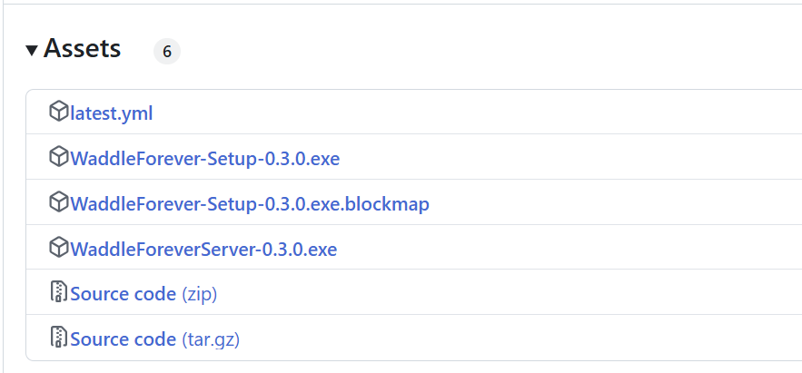

# Standalone Server

Besides using the client, you can run the Waddle Forever server by itself and then access the game via any flash method (browser, standalone, ruffle etc.), or you can still continue using the Client.

The downside of not using the client is losing the integration with the settings, which control the Waddle Forever server. You can still change the settings but it will require directly modifying the files. If you must do these changes it is still recommended to use the server.

For Windows, the server is optional, though currently it is required for Linux, since it requires `sudo` privileges to run in port 80.

# Usage

Using it is very simple, all you must do is download the server executable from the latest release. Here is an example with version 0.3.0:

Once downloaded, you should have the server in the same folder you installed Waddle Forever, and then you can run it. It will not run if another process is using the ports, specially if you have Waddle Forever running already.